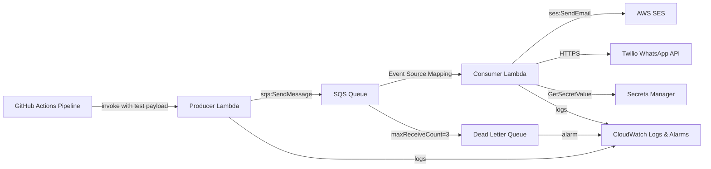

# Design Document: Event-Driven Notification System

## Overview

The Event-Driven Notification System is a serverless, AWS-native pipeline that receives structured event payloads, buffers them through SQS, and dispatches notifications via email (SES) and WhatsApp (Twilio). The entire infrastructure is managed by Terraform and the deployment lifecycle is automated through GitHub Actions.

The system follows a strict producer/consumer separation: the Producer Lambda validates and enqueues messages; the Consumer Lambda dequeues and dispatches notifications. This decoupling ensures that notification delivery failures never block event ingestion, and that the two concerns can be scaled, updated, and monitored independently.

### Key Design Goals

- Reliability: SQS buffering + DLQ ensures no message is silently lost
- Least-privilege security: each Lambda has only the IAM permissions it needs
- Observability: structured logging and CloudWatch alarms for every failure mode
- Reproducibility: all infrastructure defined in Terraform with no hardcoded values
- Correctness: payload schema validated at ingestion; idempotent consumer prevents duplicate notifications

---

## Architecture



### Data Flow

1. GitHub Actions pushes code, runs lint/tests, applies Terraform, then invokes Producer Lambda with a test payload.
2. Producer Lambda validates the JSON payload against the Payload schema. On success it calls `sqs:SendMessage` and returns the SQS message ID. On failure it returns HTTP 400.
3. SQS buffers the message. The Event Source Mapping triggers Consumer Lambda when messages are available.
4. Consumer Lambda processes each message in the batch independently. For `type=deployment` it calls SES; for all messages it calls Twilio. Failures are logged and the message item is marked failed (partial batch response).
5. After `maxReceiveCount=3` failed deliveries, SQS moves the message to the DLQ. A CloudWatch Alarm fires when DLQ depth > 0.

---

## Components and Interfaces

### Producer Lambda

**Runtime**: Python 3.12 (or Node.js 20 — chosen per team preference; interfaces below are language-agnostic)

**Entry point**: `handler(event, context)`

**Responsibilities**:
- Validate the incoming event against the Payload schema
- Publish a single SQS message
- Return a structured response (success with message ID, or 400 with error detail)
- Log every invocation result

**Interface**:
```
Input:  { event_id: string, type: string, message: string, timestamp: ISO-8601 string }
Output (success): { statusCode: 200, body: { messageId: string } }
Output (error):   { statusCode: 400, body: { error: string, field?: string } }
```

**Dependencies**: AWS SDK (SQS client), structured logger

---

### Consumer Lambda

**Entry point**: `handler(event, context)` — triggered by SQS Event Source Mapping

**Responsibilities**:
- Deserialize and validate each SQS record's body against the Payload schema
- Dispatch email via SES for `type=deployment` messages
- Dispatch WhatsApp via Twilio for all messages
- Implement idempotency check (e.g., in-memory set or DynamoDB for cross-invocation deduplication)
- Return partial batch response (`batchItemFailures`) so SQS only retries failed records
- Log every message result

**Interface**:
```
Input:  SQS Event { Records: [{ messageId, body: JSON string }] }
Output: { batchItemFailures: [{ itemIdentifier: messageId }] }
```

**Dependencies**: AWS SDK (SES client, optionally Secrets Manager), Twilio SDK, structured logger

---

### Notification Dispatcher

A module within Consumer Lambda that abstracts the two notification channels:

```
dispatch_email(payload: Payload) -> Result
dispatch_whatsapp(payload: Payload) -> Result
```

Each function is independently failable. Failures are caught, logged, and surfaced as batch item failures without propagating to other records.

---

### Terraform Modules

| Module | Resources |
|--------|-----------|
| `sqs` | SQS Queue, DLQ, redrive policy |
| `lambda` | Producer Lambda, Consumer Lambda, IAM roles/policies, Event Source Mapping |
| `observability` | CloudWatch Log Groups, metric filters, alarms |

All resource names, ARNs, and region are parameterised as Terraform input variables. Outputs expose queue URL, DLQ ARN, and Lambda function names.

---

### GitHub Actions Pipeline

**Trigger**: push to configured branch

**Jobs** (in order, with `needs:` dependencies):
1. `lint-and-test`: checkout → configure AWS credentials from secrets → lint → unit tests
2. `deploy`: (needs: lint-and-test) → `terraform init` → `terraform apply`
3. `smoke-test`: (needs: deploy) → invoke Producer Lambda with test payload

---

## Data Models

### Payload Schema

```json
{
  "event_id":  "<string, required>",
  "type":      "<string, required>",
  "message":   "<string, required>",
  "timestamp": "<string, required, ISO-8601>"
}
```

All four fields are required. `timestamp` must parse as a valid ISO-8601 datetime. No additional fields are required but extra fields should be tolerated (ignored).

### SQS Message Body

The Payload is serialized to JSON and stored verbatim as the SQS message body. No envelope wrapper is added, keeping the round-trip simple: `body = json.dumps(payload)` / `payload = json.loads(body)`.

### CloudWatch Log Entry Structure

```json
{
  "level":      "INFO | ERROR",
  "lambda":     "producer | consumer",
  "event_id":   "<string>",
  "channel":    "sqs | ses | twilio | <omitted for producer>",
  "status":     "success | failure",
  "error":      "<string, only on failure>",
  "timestamp":  "<ISO-8601>"
}
```

### IAM Policy Summary

| Lambda | Allowed Actions |
|--------|----------------|
| Producer | `sqs:SendMessage` on SQS_Queue |
| Consumer | `sqs:ReceiveMessage`, `sqs:DeleteMessage`, `logs:*`, `ses:SendEmail`, `secretsmanager:GetSecretValue` (if using Secrets Manager) |


---

## Correctness Properties

*A property is a characteristic or behavior that should hold true across all valid executions of a system — essentially, a formal statement about what the system should do. Properties serve as the bridge between human-readable specifications and machine-verifiable correctness guarantees.*

### Property 1: Payload Validation Accepts Valid and Rejects Invalid Inputs

*For any* input object, the payload validator SHALL accept it if and only if all four required fields (`event_id`, `type`, `message`, `timestamp`) are present as non-empty strings and `timestamp` is a valid ISO-8601 datetime. Any input missing a required field, containing a non-string value for a required field, or containing a malformed timestamp SHALL be rejected with a 400 response identifying the offending field.

**Validates: Requirements 2.1, 2.3, 2.4, 8.1**

---

### Property 2: Valid Payload Produces Exactly One SQS Message

*For any* valid Payload object, invoking the Producer Lambda handler SHALL result in exactly one call to `sqs:SendMessage` with the serialized payload as the message body, and the response SHALL contain the SQS-assigned message ID.

**Validates: Requirements 2.2, 2.7**

---

### Property 3: Payload Serialization Round-Trip

*For any* valid Payload object, serializing it to a JSON string and then deserializing that string SHALL yield an object with field values equal to the original. Equivalently, `deserialize(serialize(payload)) == payload` for all valid payloads.

**Validates: Requirements 8.2, 8.3**

---

### Property 4: Invalid SQS Message Body Triggers Schema Violation Logging

*For any* SQS record whose body does not conform to the Payload schema (missing fields, wrong types, or malformed timestamp), the Consumer Lambda SHALL log a schema violation entry and include that record's `messageId` in `batchItemFailures`, without affecting the processing of other records in the same batch.

**Validates: Requirements 8.4**

---

### Property 5: Batch Processing Independence (Fault Isolation)

*For any* SQS batch containing at least one message whose email or WhatsApp dispatch fails, the Consumer Lambda SHALL still attempt to process every other message in the batch. The `batchItemFailures` list SHALL contain only the identifiers of messages that actually failed; successfully processed messages SHALL NOT appear in it.

**Validates: Requirements 3.1, 3.4, 3.5**

---

### Property 6: Notification Dispatch by Message Type

*For any* valid message with `type = "deployment"`, the Consumer Lambda SHALL invoke the SES send function exactly once. *For any* valid message regardless of type, the Consumer Lambda SHALL invoke the Twilio send function exactly once.

**Validates: Requirements 3.2, 3.3**

---

### Property 7: Consumer Idempotence

*For any* `event_id`, if the Consumer Lambda processes a message with that `event_id` more than once (simulating SQS at-least-once delivery), the notification dispatch functions SHALL be called at most once per `event_id`. Subsequent invocations with the same `event_id` SHALL be detected as duplicates and skipped without error.

**Validates: Requirements 3.6**

---

### Property 8: Successful Batch Returns Empty batchItemFailures

*For any* SQS batch in which every message is processed successfully (both SES and Twilio calls succeed), the Consumer Lambda response SHALL have an empty `batchItemFailures` list, signalling SQS to delete all messages.

**Validates: Requirements 3.8**

---

### Property 9: Logging Completeness

*For any* Producer Lambda invocation (valid or invalid payload), the structured logger SHALL be called with the invocation result. *For any* Consumer Lambda message (success or failure, any channel), the structured logger SHALL be called with the processing result including `event_id`, channel, and status.

**Validates: Requirements 2.8, 3.7, 6.1, 6.2**

---

### Property 10: No Hardcoded Credentials in Source

*For any* source file in the repository (Lambda code, Terraform configs, pipeline YAML), the file SHALL NOT contain literal Twilio API keys, AWS secret keys, or account IDs. Credentials SHALL only appear as references to environment variables, GitHub Secrets, or Secrets Manager paths.

**Validates: Requirements 7.2, 5.2**

---

### Property 11: SQS Visibility Timeout Within Bounds

*For any* Terraform configuration for the SQS_Queue, the `visibility_timeout_seconds` value SHALL be an integer in the closed interval [30, 60].

**Validates: Requirements 1.1, 4.2**

---

### Property 12: DLQ Reprocessing Safety (Optional — if script is implemented)

*For any* message read from the DLQ by the reprocessing script, the script SHALL call `sqs:DeleteMessage` on the DLQ only after a successful `sqs:SendMessage` to SQS_Queue. If the send fails, the message SHALL remain in the DLQ.

**Validates: Requirements 9.2**

---

## Error Handling

### Producer Lambda

| Condition | Behaviour |
|-----------|-----------|
| Missing required field | Return 400 with `{ error: "Missing field: <name>" }` |
| Invalid ISO-8601 timestamp | Return 400 with `{ error: "Invalid timestamp format" }` |
| SQS SendMessage failure | Return 500, log error with exception detail |

### Consumer Lambda

| Condition | Behaviour |
|-----------|-----------|
| Invalid message body (schema) | Log schema violation, add to `batchItemFailures`, continue batch |
| SES send failure | Log failure with `event_id` and error, add to `batchItemFailures`, continue batch |
| Twilio send failure | Log failure with `event_id` and error, add to `batchItemFailures`, continue batch |
| Duplicate `event_id` | Log duplicate detection, skip dispatch, do NOT add to `batchItemFailures` |
| Unhandled exception | Propagate to SQS (message will be retried up to `maxReceiveCount`) |

### SQS / DLQ

After 3 failed delivery attempts (`maxReceiveCount = 3`), SQS moves the message to the DLQ. The CloudWatch Alarm on DLQ depth > 0 alerts operators. The optional reprocessing script allows manual recovery.

### Pipeline

Each job uses `needs:` to enforce ordering. If `lint-and-test` fails, `deploy` and `smoke-test` are skipped. All steps use `set -e` (or equivalent) so any non-zero exit code halts the job.

---

## Testing Strategy

### Dual Testing Approach

Both unit tests and property-based tests are required. They are complementary:
- Unit tests verify specific examples, integration points, and error conditions
- Property-based tests verify universal correctness across randomised inputs

### Unit Tests

Focus areas:
- Specific valid and invalid payload examples for the validator
- SES/Twilio mock integration: verify correct arguments are passed
- Idempotency: verify second call with same `event_id` skips dispatch
- Batch partial failure: verify `batchItemFailures` contains only failed record IDs
- Terraform output validation: verify required outputs are declared

### Property-Based Tests

**Library**: `hypothesis` (Python) or `fast-check` (TypeScript/Node.js), depending on Lambda runtime chosen.

Each property test runs a minimum of **100 iterations**.

Each test is tagged with a comment in the format:
`# Feature: event-driven-notification-system, Property <N>: <property_text>`

| Test | Property | Description |
|------|----------|-------------|
| `test_validator_accepts_valid_payloads` | Property 1 | Generate random valid payloads; validator must accept all |
| `test_validator_rejects_invalid_payloads` | Property 1 | Generate payloads with missing/malformed fields; validator must reject all with 400 |
| `test_producer_publishes_exactly_one_message` | Property 2 | Generate valid payloads; assert exactly one SQS send call |
| `test_payload_round_trip` | Property 3 | Generate valid payloads; assert serialize→deserialize identity |
| `test_invalid_body_logged_and_failed` | Property 4 | Generate invalid SQS record bodies; assert schema violation logged and record in batchItemFailures |
| `test_batch_fault_isolation` | Property 5 | Generate batches with random failure injection; assert only failed records in batchItemFailures |
| `test_notification_dispatch_by_type` | Property 6 | Generate messages with random types; assert SES called iff type=deployment, Twilio always called |
| `test_consumer_idempotence` | Property 7 | Generate event_ids; process twice; assert dispatch called once |
| `test_successful_batch_empty_failures` | Property 8 | Generate fully successful batches; assert empty batchItemFailures |
| `test_logging_completeness` | Property 9 | Generate any input; assert logger called with result |
| `test_no_hardcoded_credentials` | Property 10 | Scan all source files for credential patterns |
| `test_visibility_timeout_in_bounds` | Property 11 | Parse Terraform config; assert visibility_timeout in [30,60] |
| `test_dlq_reprocessing_safety` (optional) | Property 12 | Simulate send failures; assert delete not called before successful send |

### Integration / Smoke Tests

Run by the GitHub Actions pipeline after `terraform apply`:
- Invoke Producer Lambda with a valid test payload; assert 200 response with message ID
- Invoke Producer Lambda with an invalid payload; assert 400 response
- Wait for Consumer Lambda to process the test message; verify CloudWatch log entry appears

